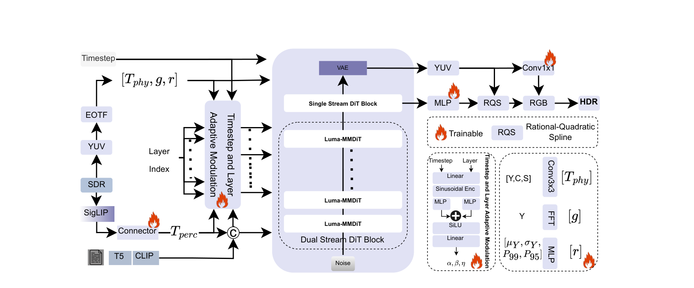

<h1 align="center">LumaFlux</h1>

<p align="center">
  <b>Lifting 8-Bit Worlds to HDR Reality with Physically-Guided Diffusion Transformers</b>
</p>

<p align="center">
  <a href="https://arxiv.org/abs/2604.02787">Paper</a>
  &nbsp;·&nbsp;
  <a href="https://huggingface.co/shreshthsaini/LumaFlux">🤗 Weights</a>
  &nbsp;·&nbsp;
  <a href="https://shreshthsaini.github.io/LumaFlux/">Project page</a>
  &nbsp;·&nbsp;
  <a href="https://shreshthsaini.github.io/LumaFlux/blogs/lumaflux.html">Blog</a>
</p>

<p align="center">
  <a href="https://arxiv.org/abs/2604.02787"></a>
  <a href="https://huggingface.co/shreshthsaini/LumaFlux"></a>
  <a href="LICENSE"></a>
  
  
</p>

<p align="center">
  Shreshth Saini<sup>1</sup>, Hakan Gedik<sup>1</sup>, Neil Birkbeck<sup>2</sup>, Yilin Wang<sup>2</sup>, Balu Adsumilli<sup>2</sup>, Alan C. Bovik<sup>1</sup>
  <br>
  <sup>1</sup>The University of Texas at Austin &nbsp;&nbsp; <sup>2</sup>Google, Inc.
</p>

<p align="center">
  
</p>

LumaFlux converts 8-bit SDR (BT.709) images and video into 10-bit HDR (PQ, BT.2020)
by adapting a **frozen** FLUX.1-dev MM-DiT. Only 71.3M parameters train, 0.57% of the
backbone. Conversion is prompt-free and runs in 8 solver steps, and the same image
model handles video with no temporal layers, optical flow, or video fine-tuning.

- **Best on every metric** of our common evaluation protocol: +0.49 dB PU21-PSNR and
  -5.06 ΔE_ITP over the strongest baseline.
- **Better and cheaper than other diffusion ITM methods**: +4.9 dB over X2HDR on the
  native track while about 6x cheaper per output pixel, with 8 steps instead of 30.
- **Training-free video stabilization** cuts excess flicker by 53.3%, with pooled
  temporal energy staying within 3.3% of the reference.
- **Robust to compression**: 0.55 dB lost across a QP 27 to 42 sweep, versus about
  2.7 dB for CNN converters.

## How it works

<p align="center">
  
</p>

The FLUX.1-dev backbone, its VAE, and the SigLIP encoder all stay frozen. Four compact
trainable modules steer them:

| Module | Role |
|---|---|
| **PGA** | Physically-Guided Adaptation: gated low-rank attention residuals driven by luminance, gradient, saturation, and spectral-band cues. |
| **PCM** | Perceptual Cross-Modulation: FiLM conditioning from frozen SigLIP features. |
| **HDR Residual Coupler** | Fuses the physical and perceptual paths under timestep-and-layer modulation. |
| **RQS tone decoder** | A monotone rational-quadratic spline that calibrates the frozen VAE decode into display-referred HDR luminance. |

Inference is a rectified-flow bridge: start at `z1 = VAE_enc(SDR) + 0.05·eps` and
integrate from `t=1` to `t=0` in 8 steps. There is no text prompt and no sampling
strength knob. For video, one noise realization is shared across frames and the
applied tone-curve parameters are smoothed with an EMA, so neighbouring frames follow
corresponding transport paths.

## Results

**Luma-Eval** (our protocol: identical inputs, output encoding, and metric
implementations for every method; 100 held-out frames).

| Method | PU21-PSNR ↑ | PU21-SSIM ↑ | ΔE_ITP ↓ | HDR-LPIPS ↓ | HDR-VDP-3 ↑ | FR-HIDRO ↓ |
|---|---:|---:|---:|---:|---:|---:|
| BT.2446c inverse | 23.74 | 0.8291 | 61.60 | 0.307 | 5.611 | 0.753 |
| Reinhard inverse | 23.62 | 0.8286 | 61.76 | 0.295 | 5.726 | 0.753 |
| HDRTVNet++ | 23.03 | 0.8192 | 66.67 | 0.328 | 5.417 | 0.703 |
| FMNet | 22.86 | 0.8176 | 67.92 | 0.330 | 5.412 | 0.724 |
| ITM-LUT | 22.92 | 0.8142 | 67.41 | 0.315 | 5.496 | 0.761 |
| VAE + RQS (no-diffusion control) | 18.54 | 0.7647 | 111.67 | 0.381 | 3.673 | 0.924 |
| **LumaFlux** | **24.23** | **0.8294** | **56.54** | **0.269** | **5.812** | **0.631** |

**Generative class** (native track, 117 pairs). Cost is normalized by output pixels at
each method's registered protocol.

| Method | Steps | PU21-PSNR ↑ | ΔE_ITP ↓ | s / megapixel ↓ | Trainable ↓ |
|---|---:|---:|---:|---:|---:|
| LEDiff | 50 | 10.99 | 198.58 | 17.0 | 860 M |
| X2HDR | 30 | 18.65 | 92.20 | 16.2 | 149 M |
| **LumaFlux** | **8** | **23.56** | **47.59** | **2.5** | **71 M** |

**HDRTV1K** (117 published test pairs, evaluated under the authors' protocol).

| Model | PSNR ↑ | SSIM ↑ | SR-SIM ↑ | ΔE_ITP ↓ | HDR-VDP-3 ↑ |
|---|---:|---:|---:|---:|---:|
| `lumaflux-hdrtv1k` (trained in-domain) | 33.34 | 0.9427 | 0.9941 | 14.69 | 7.962 |
| `lumaflux-main` (zero-shot) | 27.52 | 0.9307 | 0.9837 | 29.86 | 7.618 |

The zero-shot row is listed for transparency: the main model never sees the HDRTV1K
training split. Published baseline numbers on this benchmark retain their authors'
own protocols and are not directly rankable against ours.

## Installation

```bash
git clone https://github.com/shreshthsaini/LumaFlux.git
cd LumaFlux
pip install -e .
```

Python 3.10+ and a CUDA GPU are required for inference. The frozen backbone is pulled
from Hugging Face on first use: **FLUX.1-dev is gated**, so accept its license and log
in with `huggingface-cli login` before running.

## Weights

Adapter checkpoints live at
[🤗 shreshthsaini/LumaFlux](https://huggingface.co/shreshthsaini/LumaFlux).

| File | Trained on | Steps | Use it for |
|---|---|---:|---|
| `lumaflux-main.safetensors` | mixed UGC + PGC corpus (314,396 pairs) | 100k | default: general conversion, video, Luma-Eval |
| `lumaflux-hdrtv1k.safetensors` | HDRTV1K training split | 50k | in-domain HDRTV1K comparisons |

```bash
huggingface-cli download shreshthsaini/LumaFlux lumaflux-main.safetensors --local-dir weights
```

## Quickstart

```bash
# Video: 8-bit SDR in, 10-bit PQ/BT.2020 HEVC out (temporal stabilization on by default)
python scripts/infer.py \
  --adapters weights/lumaflux-main.safetensors \
  --input input_sdr.mp4 --output output_hdr.mp4 --steps 8

# Single image or a frame directory: 16-bit PQ/BT.2020 PNG out
python scripts/infer.py \
  --adapters weights/lumaflux-main.safetensors \
  --input frame_sdr.png --output out_frames/
```

`--no-shared-noise` and `--rqs-ema 0` disable the two video stabilization
mechanisms, which is how the ablation in the paper is reproduced. The same entry
point is available as `python -m lumaflux.inference.cli` with an explicit
`--config`.

Roughly 5.3 s and 27 GB of GPU memory per 1080p frame at the default 8 steps. Raising
the step count costs proportionally more without improving quality.

## Demo Space

`space/` holds a Gradio app: upload an SDR image, get the BT.2446c preview, the 16-bit PQ/BT.2020 PNG, and the predicted tone curve. Host your own copy with `python space/deploy.py` from a logged-in account that has accepted the FLUX.1-dev license (Gradio Spaces need a Hugging Face PRO plan, which also unlocks ZeroGPU). The script uploads the app, stores your token as the `HF_TOKEN` secret, and requests ZeroGPU.

## Data, training, and evaluation

| Guide | Contents |
|---|---|
| [`docs/DATA.md`](docs/DATA.md) | corpus composition, the degradation chain, preparing your own videos |
| [`docs/TRAINING.md`](docs/TRAINING.md) | hyperparameters, launching a run, what is trainable versus frozen |
| [`docs/EVALUATION.md`](docs/EVALUATION.md) | the seven metrics, both protocol regimes, running the benchmark |

```bash
# 1. Curate SDR/HDR pairs into safetensors shards + a manifest
python scripts/prepare_data.py --spec configs/data/example.yaml

# 2. Train the adapters (frozen backbone; 4 processes give the registered global batch 16)
accelerate launch --num_processes 4 scripts/train.py --config configs/train/main.yaml

# 3. Convert a held-out set, then score the predictions with the Luma-Eval protocol
python scripts/infer.py --adapters weights/lumaflux-main.safetensors \
  --input data/eval/sdr --output results/predictions
python scripts/benchmark.py --predictions-dir results/predictions --output-dir results/luma_eval
```

## Repository layout

```
src/lumaflux/      color science, data curation, models, training, inference, evaluation
scripts/           prepare_data · train · infer · benchmark · export_adapters
configs/           model, training, and data-source configurations
docs/              data, training, and evaluation guides
tests/             offline CPU tests
index.html         project page (GitHub Pages)
```

## License and acknowledgements

The source code in this repository is released under
[Apache-2.0](LICENSE). The adapter weights only function on top of FLUX.1-dev and are
therefore distributed under the **FLUX.1-dev Non-Commercial License**, for research
use; accept that license separately on Hugging Face.

LumaFlux builds on [FLUX.1-dev](https://huggingface.co/black-forest-labs/FLUX.1-dev)
and [SigLIP](https://huggingface.co/google/siglip-so400m-patch14-384). Evaluation and
training use CHUG, LIVE-TMHDR, HDRTV1K, and the Netflix Open Content *Sol Levante*
HDR10 master. We thank the authors of HDRTVNet++, FMNet, KUNet, ITM-LUT, LEDiff, and
X2HDR for releasing code and weights that made the comparisons possible.

## Citation

```bibtex
@article{saini2026lumaflux,
  title   = {LumaFlux: Lifting 8-Bit Worlds to HDR Reality with Physically-Guided Diffusion Transformers},
  author  = {Saini, Shreshth and Gedik, Hakan and Birkbeck, Neil and Wang, Yilin and Adsumilli, Balu and Bovik, Alan C.},
  journal = {arXiv preprint arXiv:2604.02787},
  year    = {2026}
}
```
