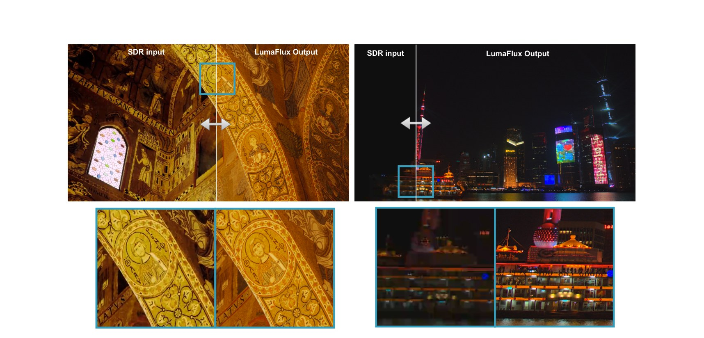

# LumaFlux

**Lifting 8-Bit Worlds to HDR Reality with Physically-Guided Diffusion Transformers**

[](https://arxiv.org/abs/2604.02787)
[](https://shreshthsaini.github.io/LumaFlux/)
[](https://shreshthsaini.github.io/LumaFlux/blogs/lumaflux.html)
[](LICENSE)

Shreshth Saini, Hakan Gedik, Neil Birkbeck, Yilin Wang, Balu Adsumilli, Alan C. Bovik
*The University of Texas at Austin · Google, Inc.*



LumaFlux converts 8-bit SDR (BT.709) video into 10-bit HDR (PQ, BT.2020) by adapting a
**frozen** Flux MM-DiT with physically interpretable modules — PGA (physically-guided
gated low-rank attention), PCM (SigLIP FiLM modulation), an HDR Residual Coupler, and a
monotone Rational-Quadratic-Spline tone-field decoder — all prompt-free and
parameter-efficient.

## Code

The full implementation (data curation, multi-node training with trackio, prompt-free
inference, evaluation suite, Gradio demo) lives in the [`lumaflux/`](lumaflux/) folder —
see its [README](lumaflux/README.md) for installation and usage.

```bash
cd lumaflux
pip install -e ".[demo,dev]"
pytest tests/                      # 57 CPU-only, offline tests

# SDR video in -> 10-bit HEVC (PQ/BT.2020) video out
python -m lumaflux.inference.cli \
  --config configs/model/flux_dev.yaml --adapters adapters.safetensors \
  --input input_sdr.mp4 --output output_hdr.mp4
```

Everything else in this repository is the project page:
[`index.html`](index.html) (project page), [`blogs/`](blogs/) (blog post),
[`static/`](static/) (figures).

## Citation

```bibtex
@article{saini2026lumaflux,
  title   = {LumaFlux: Lifting 8-Bit Worlds to HDR Reality with Physically-Guided Diffusion Transformers},
  author  = {Saini, Shreshth and Gedik, Hakan and Birkbeck, Neil and Wang, Yilin and Adsumilli, Balu and Bovik, Alan C.},
  journal = {arXiv preprint arXiv:2604.02787},
  year    = {2026}
}
```
